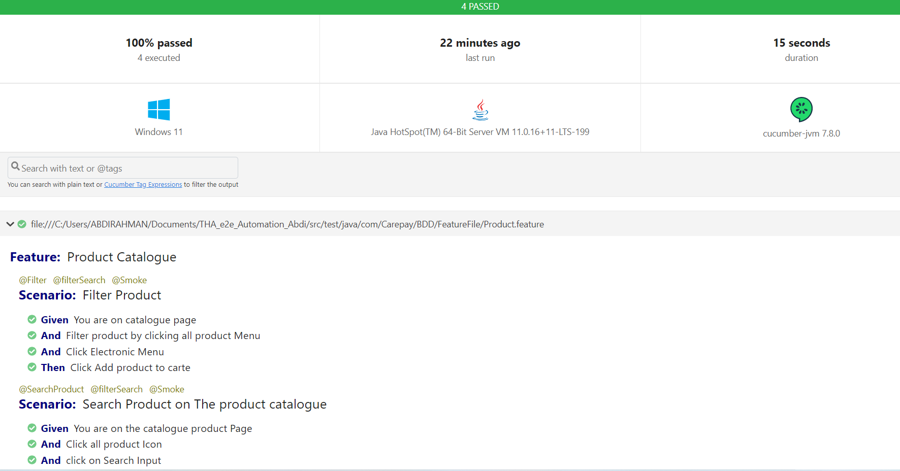
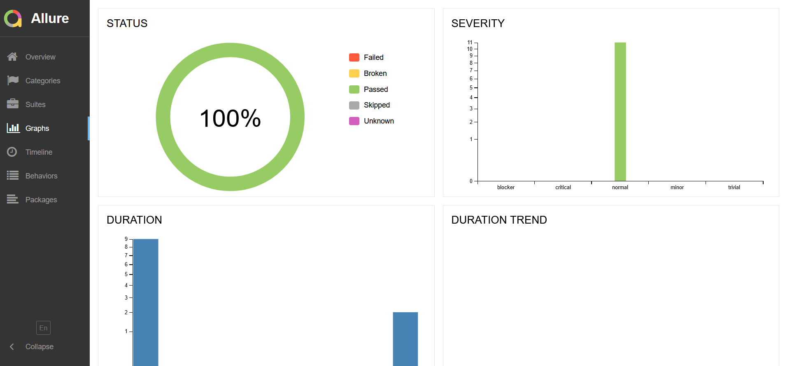
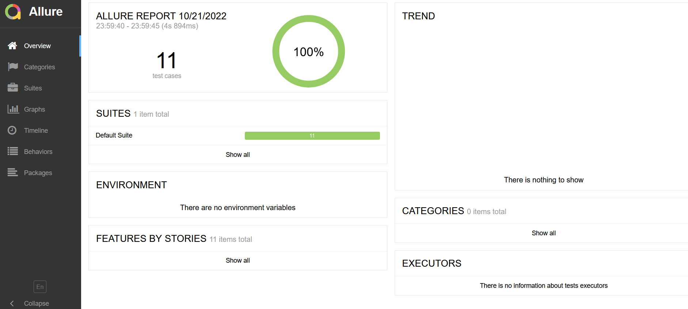

#Tools used 
1) JDK 11
2) IntelIj
3) Maven
4) allure reporting-downlaod scoop

#Technology used 
1) Selenium WebDriver
2) Cucumber BDD
3) TestNg

#Project Structure 
1) Page Object
2) Static file for url and browser 
3) Drivers- browsers
4) BDD 
5) NONBDD
6) Base Class 
7) Test Runner

#How TO Run the Project

#NONE BDD -
I created using Selenium Java and I have adopted Page object Model (POM).
All the locators and POJO classes are captured under Src Main Java.
The test classes are under Src Test Java.
You can execute either the whole test scenario or individual test case **src/test/java/com/Carepay/NonBDD/AddProductTest.java**

   

# BDD -Cucumber -------
1) lick Test Runner under BDD Package
2) Run the whole test Scenario using @Smoke tage
3) Run individual test case, Tag section update the tag name of the test case

#Allure reporting
1) terminal write allure serve<location of director allure-result>

